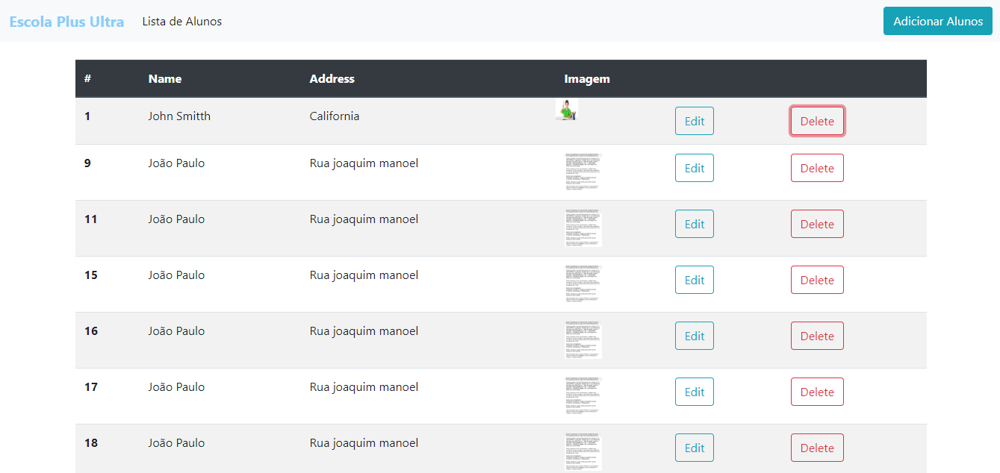
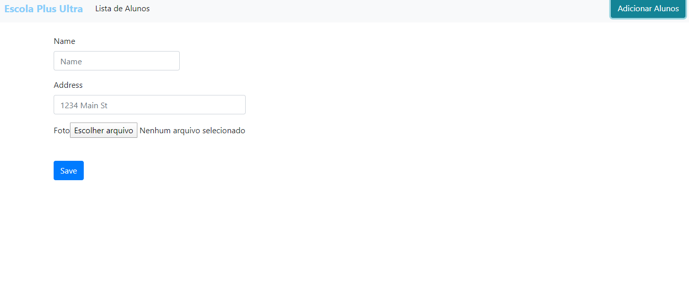

<h1>rest api crud usando Node.js , express , React.js e MySQL e bootstrap inserir foto </h1>

Para rodar o projeto basta executar o comando na basta ir na do nodeBackend e pelo terminar digitar (npm run dev), já tem o script certinho para rodar o banckend.

Depois basta ir na pasta do nodeFrontend e executar o comando (npm start) para rodar o frontend

O programa dever rodar no http://localhost:3001/, onde o react está ativo, irá aparecer a lista dos alunos no banco de dados mysql

Tem o script do banco de dados para criar o schema, 

    conf Banco de dados:
    nome: node,
    usuario:root,
    senha:1234

<h2>imagens do projeto</h2>

Lista dos alunos

Formulário para inserir um novo Aluno

